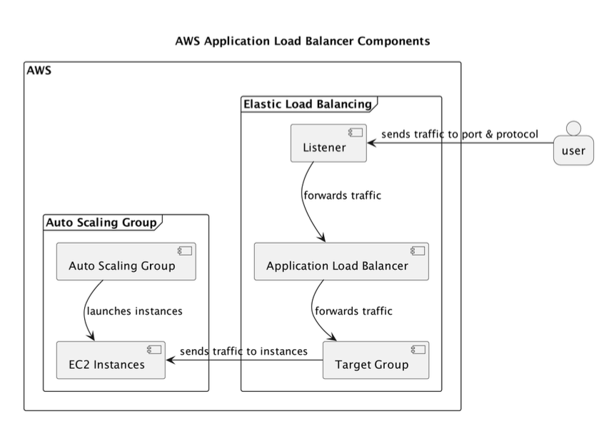

## Week7代码学习笔记

### 本周的主要任务

- 通过在 AWS 上部署 TaskOverflow 应用，使用 ECS + Application Load Balancer + Auto Scaling，使系统在面对大量用户访问时能够自动扩容，保障服务可用性和稳定性。

  注：ECS是AWS提供的一个容器编排平台，可以帮助你运行、停止管理成千上百个容器
  
  

### 具体内容如下

1. **部署负载均衡器（Load Balancer）**

   - 使用 Application Load Balancer 路由用户请求

   - 设置 Listener、Target Group 和 Health Check 保证请求只发给健康的实例

     ```yaml
     // 创建Target Group
     resource "aws_lb_target_group" "taskoverflow" {
         name     = "taskoverflow"          # 目标组的名称
         port     = 6400                    # 接收请求的端口
         protocol = "HTTP"                 # 使用 HTTP 协议处理请求
         vpc_id   = aws_security_group.taskoverflow.vpc_id  # 所在的 VPC
         target_type = "ip"                # 使用 IP 地址作为目标（而不是 EC2 实例）
         
         // 健康检查部分
         health_check {
             path = "/api/v1/health"
             port = "6400"
             protocol = "HTTP"
             healthy_threshold = 2
             unhealthy_threshold = 2
             timeout = 5
             interval = 10
         }
     }
     // 创建负载均衡器
     resource "aws_lb" "taskoverflow" {
         name = "taskoverflow"                         // 名称叫 taskoverflow
         internal = false                              // 这是一个外部可访问的负载均衡器（不是内部的）
         load_balancer_type = "application"            // 类型是“应用型”负载均衡器（Layer 7）
         subnets = data.aws_subnets.private.ids        // 部署在哪些子网（子网 ID 从 data 源获取）
         security_groups = [aws_security_group.taskoverflow_lb.id]  // 关联的安全组（见下面那段代码）
     }
     
     // 创建安全组
     resource "aws_security_group" "taskoverflow_lb" {
         name = "taskoverflow_lb"                      // 安全组名称
         description = "TaskOverflow Load Balancer Security Group"  // 功能描述
     
         ingress {
             from_port = 80                            // 允许进入的端口（HTTP）
             to_port = 80
             protocol = "tcp"                          // 协议是 TCP
             cidr_blocks = ["0.0.0.0/0"]               // 允许所有 IP 访问（0.0.0.0/0）
         }
     
         egress {
             from_port = 0                             // 出站规则，允许所有端口
             to_port = 0
             protocol = "-1"                           // 所有协议
             cidr_blocks = ["0.0.0.0/0"]               // 允许所有 IP 出站
         }
     
         tags = {
             Name = "taskoverflow_lb_security_group"   // 给资源打一个标签
         }
     }
     // 为负载均衡器添加一个监听器（Listener），监听来自用户的 HTTP 请求（80 端口），
     // 并把这些请求转发到目标组（Target Group）中运行的服务实例上
     resource "aws_lb_listener" "taskoverflow" {
         load_balancer_arn = aws_lb.taskoverflow.arn
         port = "80"
         protocol = "HTTP"
         default_action {
             type = "forward"
             target_group_arn = aws_lb_target_group.taskoverflow.arn
         }
     }
     // 输出你创建的 Load Balancer（负载均衡器）的 DNS 名称
     output "taskoverflow_dns_name" {
         value = aws_lb.taskoverflow.dns_name
         description = "DNS name of the TaskOverflow load balancer."
     }
     ```

     

2. **配置 ECS 服务（Fargate）**

   - 使用容器（无状态）部署服务
   - 用 Terraform 自动创建 ECS 资源和服务定义

3. **实现自动扩容（Auto Scaling）**

   - 设置目标追踪策略（CPU 利用率超过 20% 自动扩容）
   - 最小运行 1 个实例，最大 4 个

   ```yaml
   // 对哪个ECS服务进行自动扩容
   resource "aws_appautoscaling_target" "taskoverflow" {
       max_capacity = 4
       min_capacity = 1
       resource_id = "service/taskoverflow/taskoverflow"
       scalable_dimension = "ecs:service:DesiredCount" // 这个是扩容的维度，ECS服务的期望数量(具体来说,就是这个服务要运行几个副本)
       service_namespace = "ecs"
       depends_on = [ aws_ecs_service.taskoverflow ]
   }
   // 定义具体的扩容规则,以下是对CPU进行自动扩容,当平均 CPU 超过 20% 就会扩容，低于就缩容
   resource "aws_appautoscaling_policy" "taskoverflow-cpu" {
       name = "taskoverflow-cpu"
       policy_type = "TargetTrackingScaling"
       resource_id = aws_appautoscaling_target.taskoverflow.resource_id
       scalable_dimension = aws_appautoscaling_target.taskoverflow.scalable_dimension
       service_namespace = aws_appautoscaling_target.taskoverflow.service_namespace
       target_tracking_scaling_policy_configuration {
           predefined_metric_specification {
               predefined_metric_type = "ECSServiceAverageCPUUtilization"
           }
       target_value = 20
       }
   }

4. **进行负载测试（使用 K6）**

   - 使用 k6 模拟从 1000 到 5000 个用户访问接口 /api/v1/todos
   - 生成高并发请求，验证系统扩容能力和稳定性

   ```javascript
   import http from 'k6/http';
   import { sleep, check } from 'k6';
   export const options = {
       stages: [
           { target: 1000, duration: '1m' },
           { target: 5000, duration: '10m' },
       ],
   };
   
   export default function () {
       const res = http.get('http://taskoverflow-1924175072.us-east-1.elb.amazonaws.com/api/v1/todos');
       check(res, {'status was 200': (r) => r.status == 200 });
       sleep(1);
   }
   ```

   